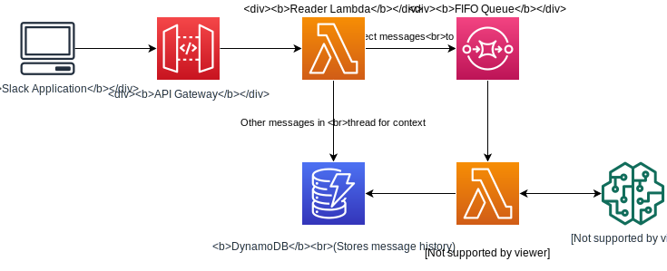

# Slack Bot
This package contains the infrastructure and the code to deploy and run a backend service that can process slack messages and respond with an answer from an LLM chain (`chain.py`). The package also contains a manifest file (`slack-bot-app.yml`) that can be imported directly to create a slack bot app. This app should be installed in your workspace for users to start using the application.

## Design


## Code organization
### app.py
Contains the infrastructure code written in CDK that will be deployed to AWS

### config.py
Contains the configuration used by the infrastructure and the application code. The current setup expects the api keys and slack bot token to be stored in Secrets Manager under the name `api-keys`. For example retrieving the secrets in the AWS console will look like this.
```json
{
    "openai-api-key": "<api-key-value>",
    "slack-bot-token": "<bot-token>"
}
```

### message_reader.py
Lambda handler that processes the incoming messages and puts them in a queue to be processed by the LLM chain or saves them to the history database. 

### message_writer.py
Lambda handler that pulls messages from the SQS queue and call the LLM chain to process the user request. The handler writes the response from the chain to the slack message thread.

### chain.py
The LLM chain code that calls the LLM with the input from the user.

## Deploying to AWS

Clone the repository
```bash
git clone https://github.com/3coins/langchain-aws-template.git
```

Move to the package directory
```bash
cd slack_bot
```

Install the dependencies, this creates a conda env named `langchain-aws-slack-bot` and activates it
```bash
conda deactivate
conda env create -f service/environment.yml # only needed once
conda activate langchain-aws-service
```

Bundle the code for lambda deployment.
```bash
./bundle.sh
```

Deploy to your AWS account. These steps require that you must have configured the AWS credentials on your machine using the AWS CLI and using an account that has permissions to deploy and create infrastructure. See setting up [AWS CLI setup page](https://docs.aws.amazon.com/cli/latest/userguide/getting-started-prereqs.html) to learn more. See the [CDK guide](https://docs.aws.amazon.com/cdk/v2/guide/getting_started.html) to learn more about CDK.
```bash
cdk bootstrap # Only needed once, if you have not used CDK before in your account
cdk deploy
```
Using the above commands will show the list of assets this code will generate and asked for a y/n prompt for you to go ahead. Selet "y" to go ahead with the deployment. Notice the API URL generated from the deployment, this will be used in the Slack app creation step.

## Creating Slack apps using manifests
Use the `slack-bot-app.yml` file to create the slack application. Update the `<api-url>` to the deployed API from the previous step. Follow the instructions here to create the app from the manifest file:
https://api.slack.com/reference/manifests#creating_apps


